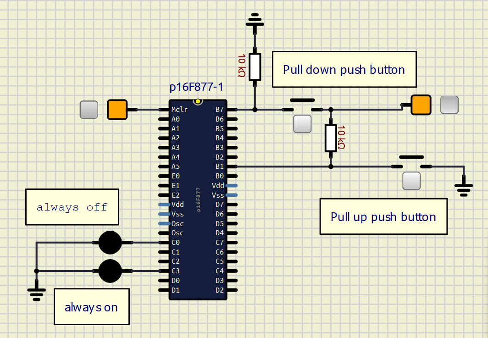
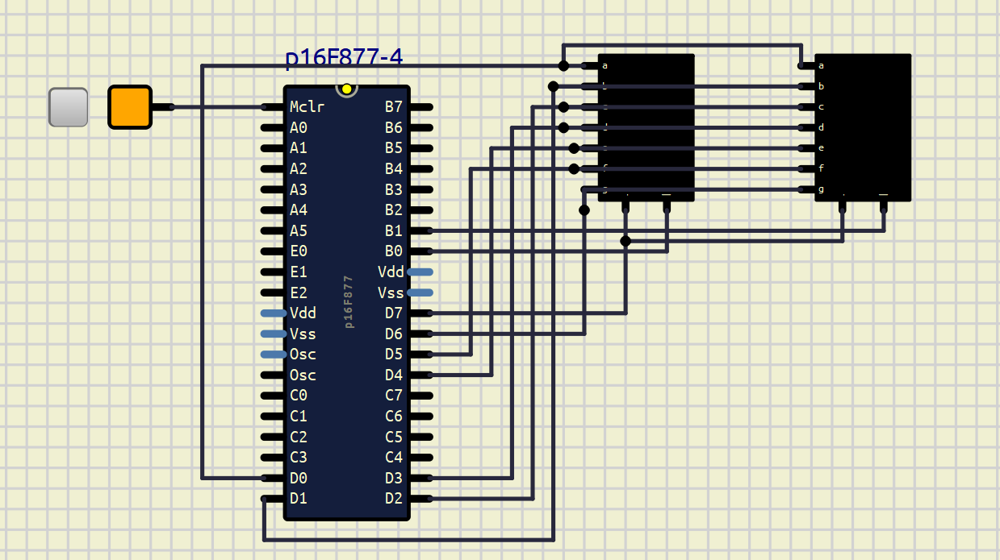
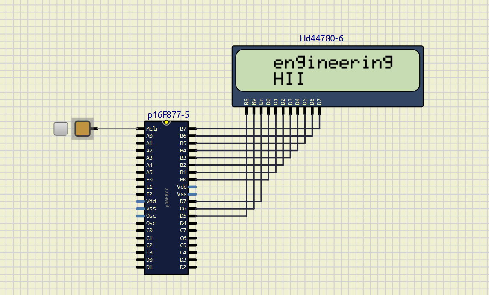
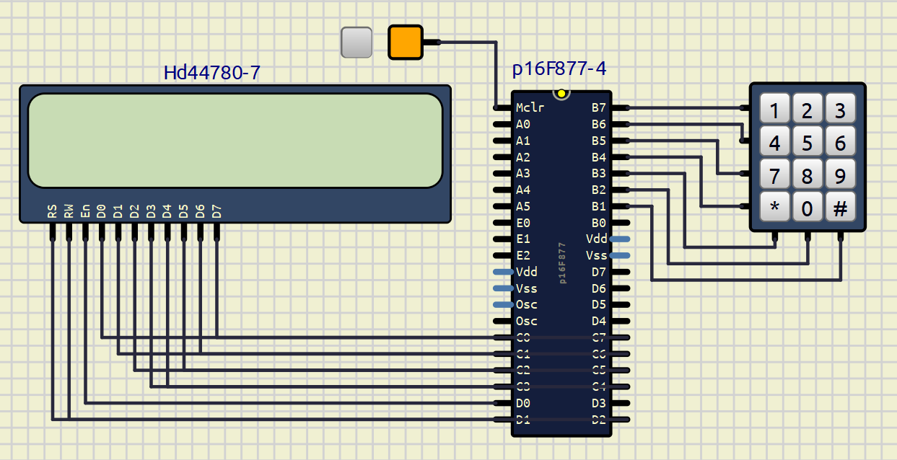
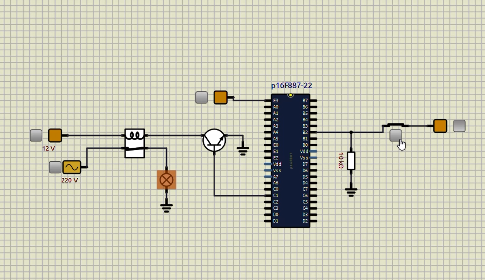

# embedded-C-with-PIC

## Introduction
Hi! This repository contains a variety of **hardware interface codes for the PIC16F877A microcontroller**. All code is written in embedded C and does not rely on any external libraries—everything is **implemented from scratch**.
Development is done using **[MPLAB X IDE](https://www.microchip.com/en-us/tools-resources/develop/mplab-x-ide)** for code writing and compilation (generation of **.hex** file), and **[SimulIDE](https://simulide.com/p/)** for functional simulation and hardware verification.
Both **tools are free, open source**, and easy to use on most platforms.

## Project 1: Blinking LED

### Description
This is a simple project to blink an LED connected to the PIC16F877A microcontroller. The LED blinks with a delay of 500ms ON and 500ms OFF indefinitely, demonstrating basic digital output control.

### Hardware Connections
- **LED** connected to **PORTB pin RB1**
- The pin is configured as output in the firmware.
- No additional components required apart from an LED and a current limiting resistor.

### Code Overview
- The code initializes PORTB, pin RB1 as an output.
- In the main loop, the LED is turned ON, a delay is applied, then the LED is turned OFF, followed by another delay.
- The delay and LED toggling repeats infinitely.

### Source Code Snippet (main.c)
```
#include <xc.h>

#define _XTAL_FREQ 20000000 // 20MHz oscillator frequency

void main(void) {
TRISCbits.TRISB1 = 0; // Configure RC0 as output
while(1) {
PORTCbits.RB1 = 1; // LED ON
__delay_ms(500);
PORTCbits.RB1 = 0; // LED OFF
__delay_ms(500);
}
}
```

### Simulation Result


### Download  
[Download Blinking LED project ZIP](Blinking_LED/Blinking_LED.zip)


## Project 2: Push Button Interface

### Description
This project demonstrates interfacing push buttons with the PIC16F877A microcontroller. The board reads inputs from push buttons connected to PORTB pins and controls LEDs connected to PORTC pins accordingly. This project teaches basic input reading, conditional logic, and output control on the PIC.

### Hardware Connections
- **Push Buttons** connected to **PORTB pins RB7 and RB1**, configured as inputs.
- **LEDs** connected to **PORTC pins RC0 and RC3**, configured as outputs.
- When a button is pressed, the corresponding LED will light up.
- Pull-up or pull-down resistors should be used externally or internal pull-ups enabled for stable button readings.

### Theory
- PIC pins set as inputs (TRISB bits = 1) can read button states (logical HIGH or LOW).
- Pins set as output (TRISC bits = 0) can drive LEDs by setting pin HIGH (LED ON) or LOW (LED OFF).
- In code, the status of button pins is checked in an infinite loop and appropriate LEDs are turned on or off.
- Proper bitwise assignments in C (`=` for assignment, not `==` for comparison) are critical for expected behavior.

### Source Code Snippet (main.c)
```
#pragma config FOSC = EXTRC // Oscillator Selection bits (RC oscillator)
#pragma config WDTE = ON // Watchdog Timer Enable bit (WDT enabled)
#pragma config PWRTE = OFF // Power-up Timer Enable bit (PWRT disabled)
#pragma config BOREN = ON // Brown-out Reset Enable bit (BOR enabled)
#pragma config LVP = ON // Low-Voltage Programming enabled
#pragma config CPD = OFF // Data EEPROM Code Protection off
#pragma config WRT = OFF // Flash Program Memory Write Enable off
#pragma config CP = OFF // Flash Program Memory Code Protection off

#include <xc.h>

#define _XTAL_FREQ 20000000

static void init_config(void){
TRISB = 0xFF; // PORTB all inputs (for buttons)
PORTB = 0x00; // Clear PORTB latch
TRISC = 0x00; // PORTC all outputs (for LEDs)
PORTC = 0x00; // Clear PORTC latch
}

void main(void) {
init_config();
while(1){
// Check status of push button connected to RB7
if(PORTBbits.RB7 == 1){
PORTCbits.RC0 = 1; // Turn ON LED at RC0
}
// Check status of push button connected to RB1
else if(PORTBbits.RB1 == 0){
PORTCbits.RC3 = 1; // Turn ON LED at RC3
}
else {
PORTCbits.RC3 = 0; // Turn OFF LEDs
PORTCbits.RC0 = 0;
}
}
}

```

### Simulation Result



## Project 3: 7-Segment Display Interface

### Description
This project demonstrates interfacing a single common-cathode 7-segment display with the PIC16F877A microcontroller. The microcontroller drives PORTD pins to display digits 0 through 9 in a loop. The project illustrates how to encode digits to segment patterns and control a 7-segment display directly.

### Hardware Connections
- **7-segment display (common cathode)** connected to **PORTD pins RD0 to RD6** as follows:

| Segment | PIC PORTD Pin |
|---------|---------------|
| a       | RD0           |
| b       | RD1           |
| c       | RD2           |
| d       | RD3           |
| e       | RD4           |
| f       | RD5           |
| g       | RD6           |

- **Common cathode** pin of the 7-segment is connected to ground.
- Each segment lights up when the corresponding PORTD pin is set HIGH (1).
- Current limiting resistors (typically 330Ω) should be used in series with each segment to protect LEDs inside the display.

### Theory of Operation
- A 7-segment display has seven LEDs labeled a to g arranged to display numerals by lighting specific segments.
- The PIC outputs a 7-bit pattern on PORTD representing each digit’s segment ON/OFF pattern.
- The array `segment[]` stores the bit patterns for digits 0 to 9.
- By cycling through this array, the microcontroller displays digits 0–9 repeatedly.
- Timing is controlled with a delay loop to make the digits readable.

### Segment Bit Patterns Explanation
Each byte in `segment[]` corresponds to the segments a-g as:

| Bit | Segment |
|-----|---------|
| 0   | a       |
| 1   | b       |
| 2   | c       |
| 3   | d       |
| 4   | e       |
| 5   | f       |
| 6   | g       |
| 7   | (unused)|

For example:  
- `0x3F` (0011 1111 binary) lights up segments a,b,c,d,e,f (digit '0')  
- `0x06` (0000 0110 binary) lights up segments b,c (digit '1')

### Source Code Snippet (main.c)
```
#include <xc.h>
#pragma config WDTE = OFF

#define _XTAL_FREQ 20000000 // oscillator frequency

unsigned char segment[] = {0x3F, 0x06, 0x5B, 0x4F, 0x66,
0x6D, 0x7C, 0x07, 0x7F, 0x6F};

static void init_config(void) {
TRISD = 0x00; // Configure PORTD as output
PORTD = 0x00; // Clear PORTD
}

void main(void) {
init_config();
while(1) {
for(unsigned char i = 0; i < 10; i++) {
PORTD = segment[i]; // Output pattern for digit i
for(unsigned long j = 50000; j--; ); // Delay loop
}
}
}

```
### Simulation Result



## Project 4: LCD Display Interface in 8-bit and 4-bit Modes

### Description

This project demonstrates interfacing a 16x2 character LCD (HD44780 compatible) with the PIC16F877A microcontroller. The code provides both theory and a full working example for **8-bit mode** and explains **4-bit mode**, including how to send data using only four data lines.

---

### LCD Theory: 8-bit vs 4-bit Mode

#### **How the LCD Works**
- A 16x2 LCD has 16 columns and 2 rows. Each character cell is a 5x8 dot matrix display, where characters appear by lighting selected LEDs (dots).
- Most displays use an HD44780 controller, which provides two main registers:
  - **Instruction Register (IR):** Receives commands (move cursor, clear display, etc.)
  - **Data Register (DR):** Receives the actual characters to display.
- Each character position on the LCD maps to a specific address in Display Data RAM (DDRAM):
  - **Row 1:** Addresses 0x80–0x8F
  - **Row 2:** Addresses 0xC0–0xCF

#### **Pins**
- **RS:** Register Select (0 = command, 1 = data)
- **RW:** Read/Write (0 = write, 1 = read, usually kept at 0)
- **EN:** Enable (triggered High-Low pulse to latch data/command)
- **D0-D7:** Data pins (8 for 8-bit mode, D4-D7 only for 4-bit mode)

---

### 8-bit vs 4-bit Mode

- **8-bit mode:** Uses eight data lines (D0-D7) for sending commands/data. Faster and easier to implement, but uses many I/O pins.
- **4-bit mode:** Uses only four data lines (D4–D7). You send each byte as two "nibbles":
  - First the higher nibble (MSB, bits 7–4)
  - Then the lower nibble (LSB, bits 3–0), shifted to the high bits.
  - Saves pins at the cost of code complexity and speed.

**Typical sequence for 4-bit mode:**  
For `data` (8 bits):
1. Send `(data & 0xF0)` (upper 4 bits, aligned to D7-D4)
2. Pulse EN
3. Send `((data << 4) & 0xF0)` (lower 4 bits, aligned to D7-D4)
4. Pulse EN

---

### Hardware Connections (For 8-bit Mode Example Code Below)
- **LCD D0–D7** → **PORTB RB0–RB7**
- **RS** → **RD5**
- **RW** → **RD6**
- **EN** → **RD7**
- **Vss, Vdd, V0, Backlight**: Standard LCD power connections (see LCD datasheet)

---

### Example: 8-bit Mode Code
```
#pragma config FOSC = EXTRC
#pragma config WDTE = ON
#pragma config PWRTE = OFF
#pragma config BOREN = ON
#pragma config LVP = ON
#pragma config CPD = OFF
#pragma config WRT = OFF
#pragma config CP = OFF

#include <xc.h>

#define _XTAL_FREQ 20000000

#define RS PORTDbits.RD5
#define RW PORTDbits.RD6
#define EN PORTDbits.RD7

void lcddata(unsigned char data) {
PORTB = data;
RS = 1;
RW = 0;
EN = 1;
__delay_ms(5);
EN = 0;
}

void lcd_command(unsigned char cmd) {
PORTB = cmd;
RS = 0;
RW = 0;
EN = 1;
__delay_ms(5);
EN = 0;
}

void lcd_string(const unsigned char *str, unsigned char num) {
for(unsigned char i = 0; i < num; i++) {
lcddata(str[i]);
}
}

void lcdinit() {
lcd_command(0x38); // 8-bit, 2 lines, 5x8 matrix
lcd_command(0x06); // Increment cursor
lcd_command(0x0C); // Display ON, cursor OFF
lcd_command(0x01); // Clear display
}

static void init_config(void) {
TRISB = 0x00; // PORTB as output (data pins)
PORTB = 0x00;
TRISD = 0x00; // PORTD as output (control pins)
PORTD = 0x00;
}

void main(void) {
init_config();
lcdinit();
while(1) {
__delay_ms(1000);
lcd_command(0x83); // Go to col 3 of row 1
lcd_string("Shravana", 8);
lcd_command(0xC3); // Go to col 3 of row 2
lcd_string("SHS", 3);
__delay_ms(1000);
lcd_command(0x01); // Clear screen
    lcd_command(0x83);
    lcd_string("engineering", 11);
    lcd_command(0xC3);
    lcd_string("HII", 3);
    __delay_ms(1000);
    lcd_command(0x01);
}
}

```
---

### 4-bit Mode Theory and Pseudocode

**4-bit mode saves pins:**  
- Only D4–D7 pins (often connected to RB4–RB7 or RC4–RC7) are used.
- Each byte is split into two nibbles and sent in sequence: first upper, then lower.

**Pseudocode for sending in 4-bit mode:**
// Send upper nibble
PORTX = (data & 0xF0); // Mask and send upper nibble (D7–D4)
RS = x; RW = 0;
EN = 1; delay; EN = 0;

// Send lower nibble, shifted to D7–D4
PORTX = ((data << 4) & 0xF0); // Shift lower nibble to upper bits
RS = x; RW = 0;
EN = 1; delay; EN = 0;


- `RS = 1` for data; `RS = 0` for command.

**You must initialize the LCD in 4-bit mode with a specific command sequence** (see HD44780 datasheet for details).

---

### LCD Commands Reference

| Command        | Function                     |
|----------------|-----------------------------|
| `0x38`         | 16x2, 8-bit mode            |
| `0x06`         | Cursor auto-increment       |
| `0x0C`         | Display ON, cursor OFF      |
| `0x01`         | Clear display               |
| `0x80–0x8F`    | DDRAM addresses (row 1)     |
| `0xC0–0xCF`    | DDRAM addresses (row 2)     |

---

### Simulation Result



---

## Project 5: Keypad Interfacing with PIC16F877A

### Description
This project demonstrates interfacing a 4x3 matrix keypad with the PIC16F877A microcontroller and displaying the pressed key on a 16x2 LCD. The keypad scanning is done using the row-column method, where the columns are driven as outputs and rows as inputs. By sequentially activating one column at a time and reading the rows, the pressed key can be identified.

---

### Hardware Connections

| Keypad Pin | PIC Pin (PORTB) | Direction      | Function          |
|------------|-----------------|----------------|-------------------|
| Column 1   | RB3 (C1)        | Output         | Drive column 1    |
| Column 2   | RB2 (C2)        | Output         | Drive column 2    |
| Column 3   | RB1 (C3)        | Output         | Drive column 3    |
| Row 1      | RB7 (B1)        | Input (with pull-up) | Read row 1    |
| Row 2      | RB6 (B2)        | Input (with pull-up) | Read row 2    |
| Row 3      | RB5 (B3)        | Input (with pull-up) | Read row 3    |
| Row 4      | RB4 (B4)        | Input (with pull-up) | Read row 4    |

**LCD** data connected to **PORTC** and control pins to **PORTD** (RD0-RD2) as per your code.

---

### Theory: How Row-Column Scanning Works

A matrix keypad internally connects buttons in rows and columns. Pressing a specific button bridges one row and one column.

Since each button closes contact between one row and one column, the MCU can determine **which button** is pressed by:

1. Sequentially driving **one column output low** at a time (others high).
2. Reading all the row inputs.
3. If any row reads low (0), it implies that particular row's button in the current column is pressed.
4. By repeating this for each column and reading rows, the exact key can be decoded.

**Why do we do this?**  
Instead of dedicating one I/O pin per button (which would be 12 pins for 12 keys), matrix scanning lets you scan all keys with fewer pins (7 pins in your case: 3 columns output + 4 rows input).

---

### Important Notes on Implementation

- **Pull-up resistors:** Rows are inputs and need to have stable logic when keys are not pressed. Internal pull-ups are enabled via `OPTION_REGbits.nRBPU = 0;` or external pull-ups used.
- **Logic levels:**  
  - Columns are driven LOW one-by-one.
  - When a key is pressed, the corresponding row input is pulled LOW.
- **Debouncing:** Your code uses `while(Bx == 1);` which waits for a key release, providing simple debouncing.
- **LCD display:** The detected key is immediately displayed on the LCD by sending the ASCII character corresponding to the key.

---

### Code Explanation 
```
#pragma config FOSC = EXTRC       // Oscillator Selection bits (RC oscillator)
#pragma config WDTE = ON          // Watchdog Timer Enable bit (WDT enabled)
#pragma config PWRTE = OFF        // Power-up Timer Enable bit (PWRT disabled)
#pragma config BOREN = ON         // Brown-out Reset Enable bit (BOR enabled)
#pragma config LVP = ON           // Low-Voltage Programming enabled
#pragma config CPD = OFF          // Data EEPROM Memory Code Protection off
#pragma config WRT = OFF          // Flash Program Memory Write Enable off
#pragma config CP = OFF           // Flash Program Memory Code Protection off

#include <xc.h>

#define _XTAL_FREQ 20000000

// LCD Control Pin Definitions
#define RS PORTDbits.RD2
#define RW PORTDbits.RD1
#define EN PORTDbits.RD0

// Keypad Column Pins (outputs)
#define C1 PORTBbits.RB3
#define C2 PORTBbits.RB2
#define C3 PORTBbits.RB1

// Keypad Row Pins (inputs)
#define R1 PORTBbits.RB7
#define R2 PORTBbits.RB6
#define R3 PORTBbits.RB5
#define R4 PORTBbits.RB4

// LCD Functions
void lcd_command(unsigned char cmd){
    PORTC = cmd;
    RS = 0; RW = 0; EN = 1;
    __delay_ms(5);
    EN = 0;
}

void lcd_data(unsigned char data){
    PORTC = data;
    RS = 1; RW = 0; EN = 1;
    __delay_ms(5);
    EN = 0;
}

void lcd_string(const unsigned char* str, unsigned char len){
    for(unsigned char i = 0; i < len; i++){
        lcd_data(str[i]);
    }
}

void lcd_init(void){
    TRISC = 0x00;  // LCD Data port output
    TRISD = 0x00;  // LCD control pins output
    lcd_command(0x38); // 8-bit, 2 lines, 5x8 font
    lcd_command(0x06); // Cursor Auto Increment
    lcd_command(0x0C); // Display ON Cursor OFF
    lcd_command(0x01); // Clear display
    __delay_ms(2);
}

// Keypad scan function
void keypad_scan(void){
    // Set all columns high initially (disabled)
    C1 = 1; C2 = 1; C3 = 1;

    // Scan Column 1 (C1 low)
    C1 = 0; C2 = 1; C3 = 1;
    if(R1 == 0){ lcd_data('1'); while(R1 == 0); }
    else if(R2 == 0){ lcd_data('4'); while(R2 == 0); }
    else if(R3 == 0){ lcd_data('7'); while(R3 == 0); }
    else if(R4 == 0){ lcd_data('*'); while(R4 == 0); }

    // Scan Column 2 (C2 low)
    C1 = 1; C2 = 0; C3 = 1;
    if(R1 == 0){ lcd_data('2'); while(R1 == 0); }
    else if(R2 == 0){ lcd_data('5'); while(R2 == 0); }
    else if(R3 == 0){ lcd_data('8'); while(R3 == 0); }
    else if(R4 == 0){ lcd_data('0'); while(R4 == 0); }

    // Scan Column 3 (C3 low)
    C1 = 1; C2 = 1; C3 = 0;
    if(R1 == 0){ lcd_data('3'); while(R1 == 0); }
    else if(R2 == 0){ lcd_data('6'); while(R2 == 0); }
    else if(R3 == 0){ lcd_data('9'); while(R3 == 0); }
    else if(R4 == 0){ lcd_data('#'); while(R4 == 0); }

    // Reset columns high (inactive)
    C1 = 1; C2 = 1; C3 = 1;
}

void main(void){
    // Initialize ports:
    TRISC = 0x00;       // PORTC as output for LCD data
    TRISD = 0x00;       // PORTD as output for LCD control
    TRISB = 0xF0;       // RB7-RB4 inputs (rows), RB3-RB1 outputs (columns)
    OPTION_REGbits.nRBPU = 0;  // Enable PORTB pull-ups

    lcd_init();

    lcd_command(0x83);  // Set cursor position (row 1, col 3)
    lcd_string((const unsigned char *)"keypad", 6);
    lcd_command(0xC3);  // Set cursor position (row 2, col 3)
    
    while(1){
        keypad_scan();   // Scan keypad and print pressed key on LCD
    }
}


```

- Here, only one column pin is driven LOW at a time; the others are kept HIGH.
- Rows are read to detect pressed keystroke.
- Upon detecting a pressed key (row reads LOW), the corresponding character is sent to `lcddata()` to display on LCD.
- The `while(Bx == 0);` loops wait for the button release, preventing multiple detections (simple debounce).

---


---

### Summary

- Keypad interfacing saves pins by using matrix scanning, controlling columns and reading rows.
- Drive columns LOW one by one and read the rows to detect key presses.
- Use internal or external pull-ups for stable input.
- Display the detected key immediately on LCD.
- Use simple debounce via waiting for button release.

---

### Simulation Result

  


---


## Project 6: Relay Integration with PIC16F877A

### Description
This project demonstrates how to control a relay using the PIC16F877A microcontroller. Relays allow you to switch high-voltage or high-current devices (like lamps or motors) using the low-power I/O of the PIC. In this example, the relay is toggled on and off at 0.5 second intervals, which can be used to switch any device connected to the relay’s NO (Normally Open) contacts.

---

### Theory and Circuit Explanation

**Relay Basics:**
- A relay is an electromechanical switch. It uses a small current to energize a coil, which closes a set of contacts to switch a larger load (AC or DC).
- Microcontrollers like the PIC cannot drive a relay coil directly due to current limitations.
- Typically, an NPN transistor (such as a BC547) is used as a driver. The PIC output pin controls the base of the transistor through a resistor. When the pin is high, the transistor conducts and energizes the relay coil.
- A flyback diode is placed across the relay coil to protect the transistor from voltage spikes when the relay switches off.

**Refer to the schematic:**
- The circuit in your image shows a relay driver using a transistor, a relay coil, and a flyback diode.
- The relay switches a 220V AC lamp, which is isolated from the PIC by the relay's contacts.
- The relay coil is powered by 12V DC, and the control line comes from one of the microcontroller's output pins (RB1 in this example).

---

### Hardware Connections (from schematic and code)

| Signal    | PIC Pin      | External Circuit                |
|-----------|--------------|---------------------------------|
| Relay IN  | RB1 (PORTB1) | Transistor base (via resistor)  |
| 12VDC     | Relay coil   | Relay V+                        |
| GND       | PIC + Relay  | Common ground for both circuits |
| Lamp AC   | Relay NO/COM | Controlled by relay contacts    |

---

### Source Code: Relay Blinking with PIC
```
#include <xc.h>

#define _XTAL_FREQ 20000000 // 20MHz oscillator frequency

void main(void) {
TRISBbits.TRISB1 = 0; // Configure RB1 as output (relay control)
while(1) {
PORTBbits.RB1 = 1; // Relay ON (transistor conducts, coil energized)
__delay_ms(500); // Wait 500ms
PORTBbits.RB1 = 0; // Relay OFF
__delay_ms(500); // Wait 500ms
}
}

```

---

### Working
- When RB1 is set HIGH, the transistor switches on, energizing the relay coil and closing the relay contacts. This switches ON the connected load (e.g., a lamp).
- When RB1 is set LOW, the transistor turns off, the relay coil is de-energized, and the lamp turns OFF.
- This cycle repeats, so the relay (and load) toggles every 0.5 seconds.

---

### Simulation Result



---


